# Retail Finance

[](https://github.com/kyle1054/retail-finance/actions/workflows/tests.yml)

**Deductions · Cards · Cash** — the three things a retail finance team chases
every month, in one system.

A Flask application for the money that moves between a multi-store retailer and
its own people. Staff buy uniform on terms and put items on lay-by; till
operators undercharge and the difference has to be recovered; cardholders spend
company money and owe receipts for it; stores take cash that has to reconcile
and reach the ledger. Each of those is a different kind of debt with a different
way of going wrong, and each one is a module here.

This repository is a **demonstration build** of a system built for a real
retailer: the same application with a fictional company, fictional stores and
staff, an illustrative chart of accounts, and no real data of any kind. It
starts empty and you populate it — see [Demo data](#demo-data).

## See it without a hosted demo

There is deliberately no public server to keep alive. This README is the
portfolio: GitHub renders the walkthrough and screenshots directly, while the
repository contains everything needed to run the same flows locally.

<p align="center">
  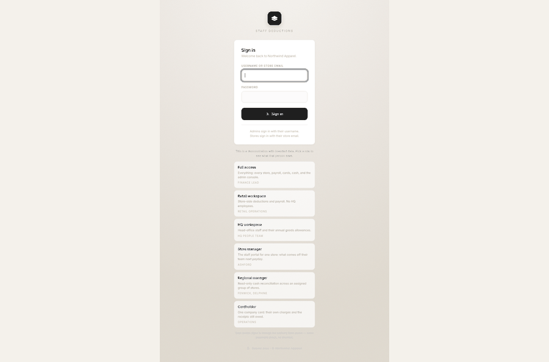
</p>

<p align="center"><sub>From the demo role picker to the finance workspace. The
GIF is two real application screens, compressed to 170 KB so the README stays
fast; the detailed views below remain full-resolution PNGs so their figures and
controls are legible.</sub></p>

### The workflow in one minute

1. A store submits a uniform or lay-by request from the staff portal.
2. Finance reviews the request and turns approval into a scheduled deduction
   plan; there is no second copy to re-key.
3. The monthly payroll view calculates the instalment due from every active
   plan, including undercharge recoveries.
4. Finance ticks what payroll will process, exports the period, reconciles the
   result and locks the month against retrospective edits.
5. Card and cash modules run their own evidence and exception checks before
   producing ledger-ready exports.

That is the common idea across the application: capture the obligation once,
make the exceptions visible, and preserve what actually happened at month-end.

## What it does

Every figure below is invented demo data, generated by `scripts/seed_demo.py`.
No real company, person, store, merchant or transaction appears anywhere in this
repository.

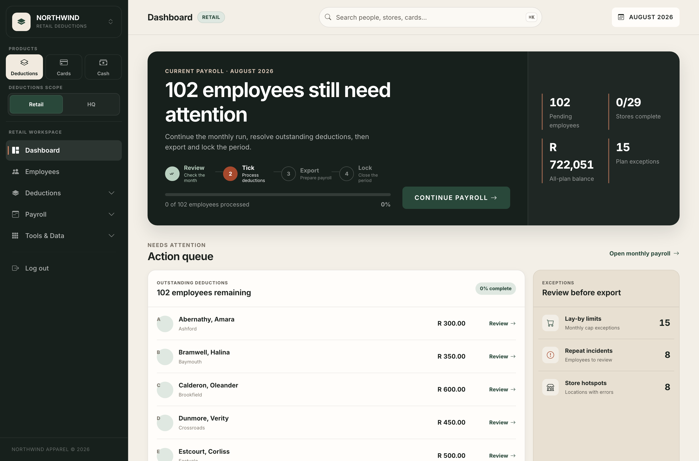

**The dashboard is the month in one screen.** Payroll runs on a date, so the
work is a sequence, not a list: review what is outstanding, tick what payroll
will actually deduct, export the sheet, then lock the period. The right-hand
column is the exceptions — lay-by limits breached, repeat offenders, stores
generating errors — because those are what stop a month closing.

---

### Payroll deductions

A staff member buys three shirts on a six-month plan. The app schedules the
instalments, tracks what has been ticked off against payroll each month, and
**locks the period once payroll has run** so nothing can be edited behind it.
Then it reconciles the sheet payroll actually processed against what the app
expected, because those two disagree more often than anyone would like.

| The monthly run | One person's whole position |
|---|---|
| 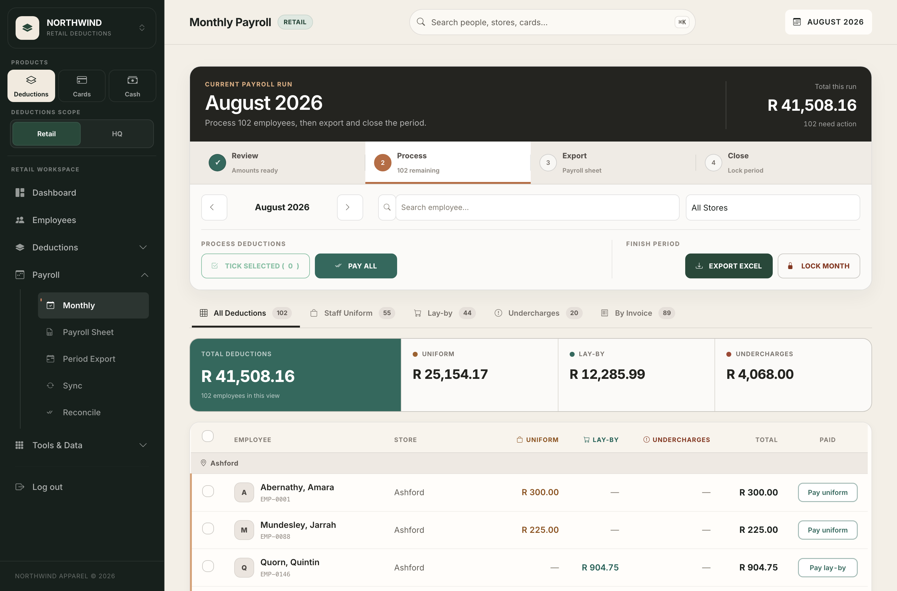 | 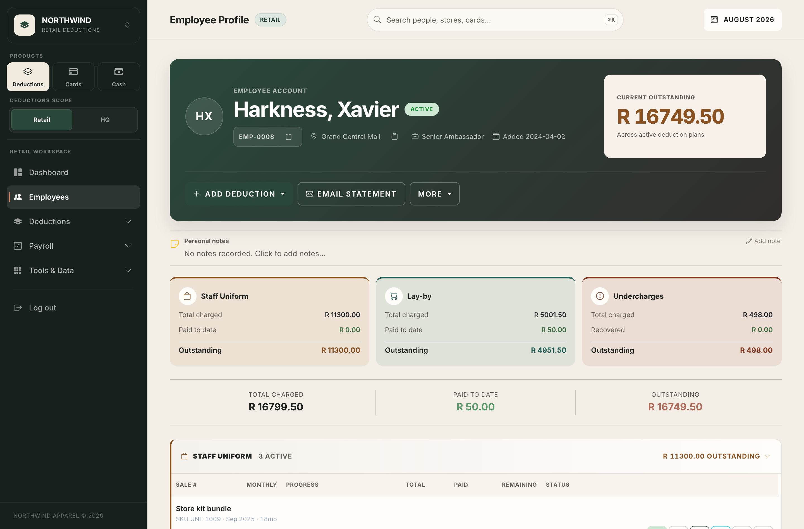 |
| <sub>102 employees for August, split across uniform, lay-by and undercharges, with per-line tick and a bulk pass. "Lock month" is the point of no return.</sub> | <sub>Every plan one person is carrying, in one place: charged, paid, outstanding, per category — the view you need when someone asks "why is this coming off my pay?"</sub> |

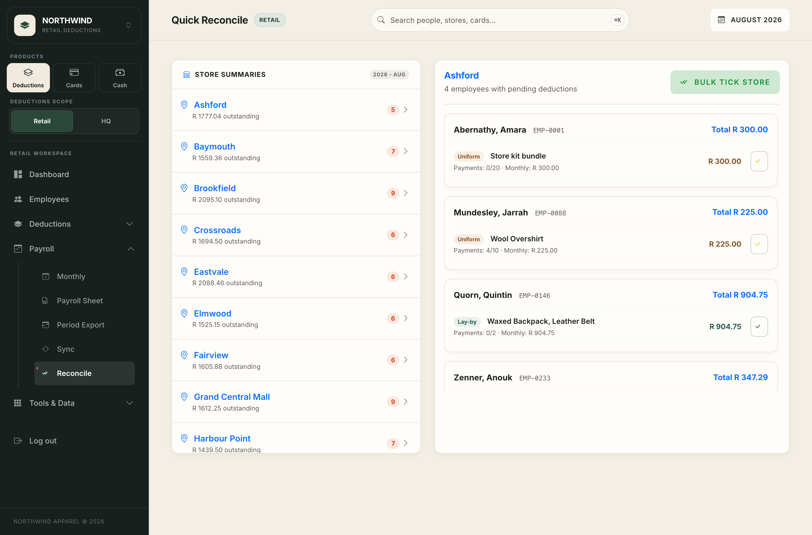

<sub>The reconciliation view turns a large payroll run into a store-by-store
checklist. The left side shows each store's outstanding value and number of
lines; the selected store expands into employees and individual plans on the
right. Finance can confirm one line or bulk-tick a store, while still seeing the
plan type, monthly amount and payment progress behind every figure.</sub>

The three views answer different control questions: the monthly run says *what
is due now*, the employee profile explains *why that person owes it*, and quick
reconcile records *what payroll is actually taking*. Keeping those questions
separate prevents a convenient summary from becoming an untraceable total.

### Undercharges

A till operator rings up R1 200 of stock as R200. The difference is recorded
against them and scheduled for recovery over one or several months.

The part that matters is the audit trail. A recovery can be rescheduled, partly
paid, settled by the customer, or written off — and every one of those has to be
reconstructable afterwards, because it is money owed by a named person.

| Find and prioritise exceptions | Explain one balance completely |
|---|---|
| 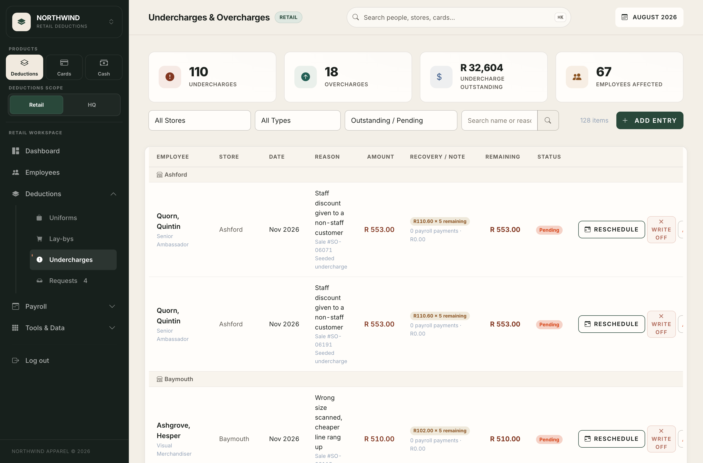 | 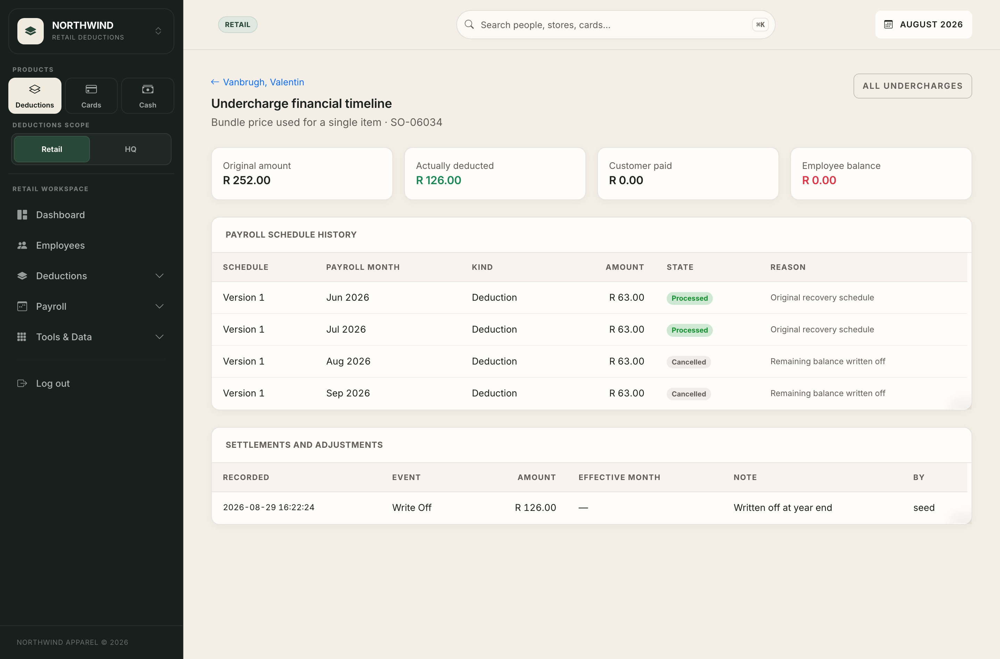 |
| <sub>The operational register groups incidents by store and exposes count, value, recovery schedule, remaining balance and status. Store/type/status filters keep the queue usable at scale; reschedule and write-off actions remain attached to the incident.</sub> | <sub>The financial timeline for a single undercharge: the original amount, what was actually deducted, what the customer paid, and the balance — over a versioned payroll schedule, with every settlement and adjustment recorded underneath.</sub> |

The register is intentionally not just a debt total. The original incident,
reason, sale reference, affected employee, recovery terms and current status
travel together, so an exception can be followed from discovery to settlement
without reconstructing it from email and spreadsheets.

### The staff portal

Each store gets its own login. Staff see what is coming off their next payslip
without asking anyone, and can request a uniform purchase or a lay-by. The
request lands in an admin queue and converts into a real deduction plan in one
step, so the thing the store asked for and the thing that reaches payroll cannot
drift apart.

| On the shop floor | The queue it lands in |
|---|---|
| 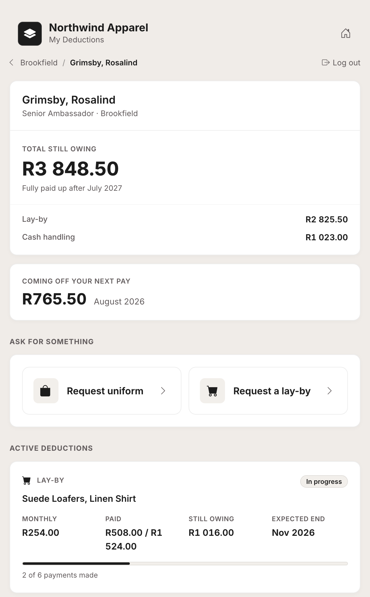 | 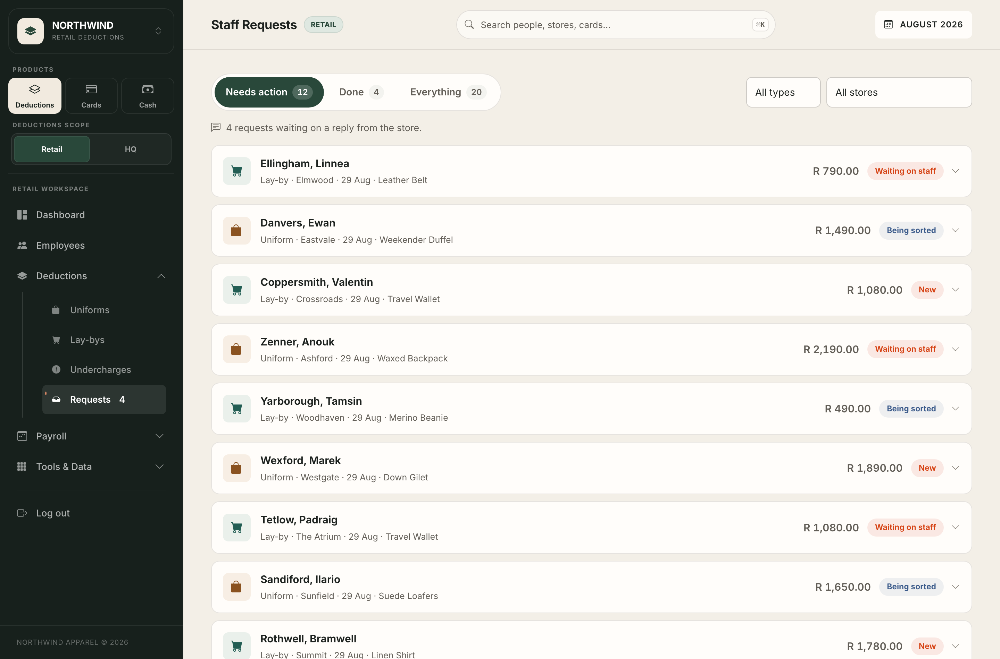 |
| <sub>What one staff member sees: total still owing, what comes off next payday, and the two things they can ask for. Built narrow — it is used on a phone behind the till.</sub> | <sub>The admin side: every request with its status, amount and store. One click turns an approved request into a scheduled deduction.</sub> |

### Credit-card reconciliation

Import a Xero reconciliation export and every cardholder is held to account for
receipts against their own charges: what is outstanding, what has been coded,
what is still unexplained.

Receipts are matched to charges on amount, date and merchant with **tiered
confidence** — an exact three-way agreement links automatically, anything
ambiguous is queued for a human. The matching is pure functions with no I/O, so
the part where the money risk lives is directly unit-testable.

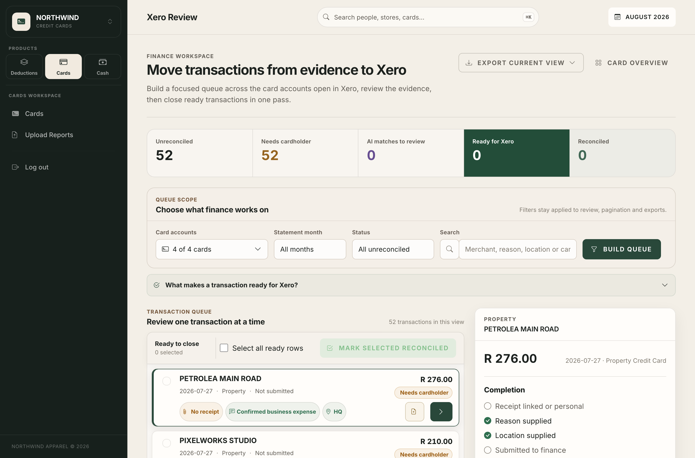

<sub>One transaction at a time: the evidence on the right, the completion
checklist beneath it. A charge is only ready for Xero once the receipt, the
reason and the location are all in.</sub>

### Cash reconciliation

A per-store cash ledger with a fixed category picklist, a computed running
balance, and an export that imports into Xero as a journal.

Stores also take cash through the POS, so the second half is a monthly control:
compare what the store wrote down against what the payment system says, make
somebody explain every difference over R1, and only then produce the journal.

| A store's ledger | The month-end control |
|---|---|
| 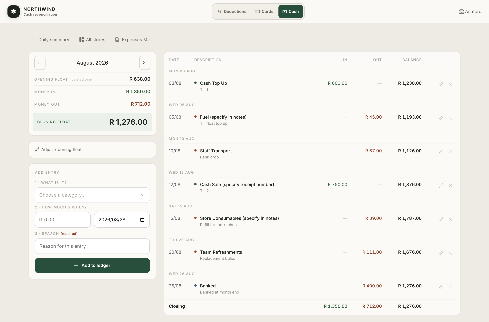 | 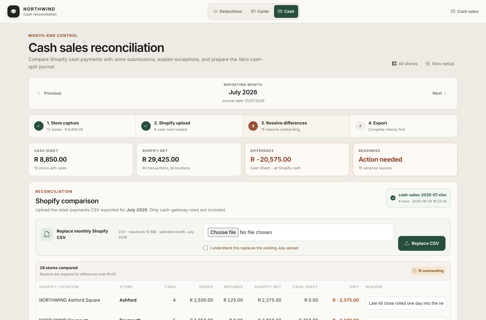 |
| <sub>Opening float carried over, money in and out by category, closing float that has to agree. Entries need a reason before they save.</sub> | <sub>Four gated steps. The difference is R -20,575 and 15 stores still owe an explanation, so the export stays locked.</sub> |

### Reporting and oversight

Two questions get asked constantly — *which stores are the problem?* and *what
is happening in my region?* — and they want different answers with different
permissions.

| Every store, all three debts | Read-only, region-scoped |
|---|---|
| 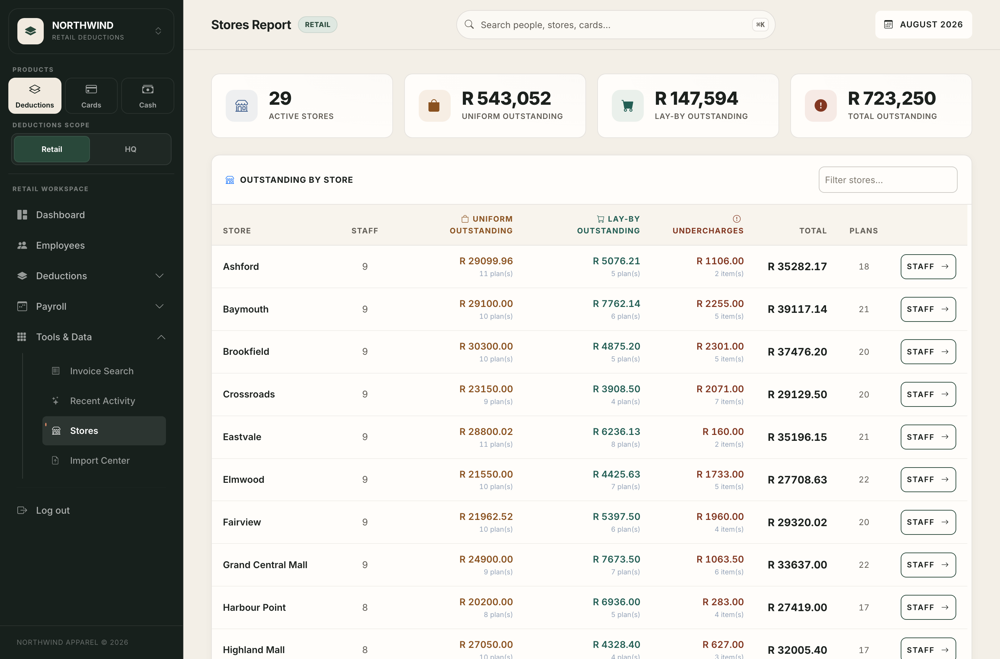 | 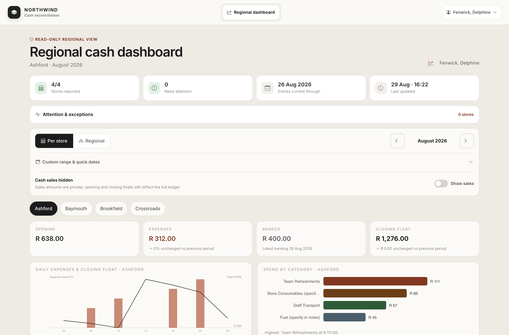 |
| <sub>29 stores with uniform, lay-by and undercharge balances side by side, so a systematic problem is visible rather than anecdotal.</sub> | <sub>A regional manager sees only their own stores, cannot edit anything, and sales figures stay hidden — while floats and expenses still reconcile.</sub> |

### Six kinds of user, one login box

The interesting thing about this app is that six kinds of person see six
different things, and a single sign-in form does a poor job of showing that. In
demo mode the sign-in page offers the roles directly.

Each button submits **the ordinary sign-in form** with a known identifier and
password, so the request goes through exactly the same lockout, hashing and role
resolution as anyone else's. There is no bypass and no branch in the login code
that trusts demo mode.

<p align="center">
  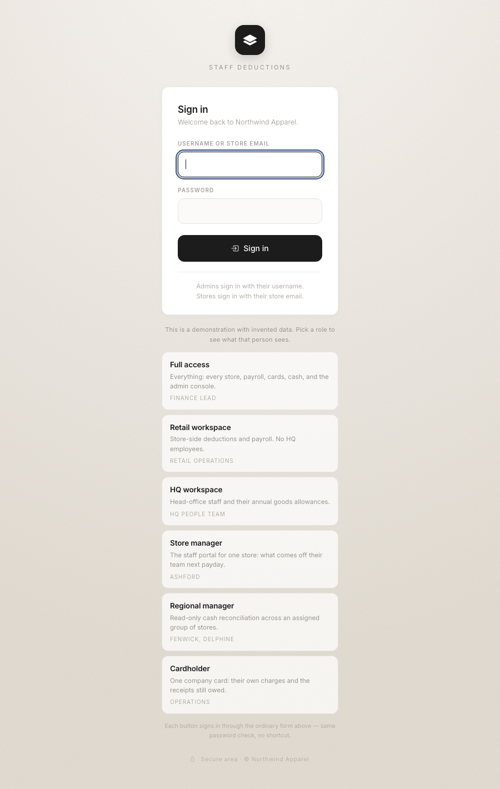
</p>

---

## How it is built

| | |
|---|---|
| Web | Flask, server-rendered Jinja, progressive-enhancement JS (no build step) |
| Data | SQLite, single writer |
| Money | Integer cents in the base tables, with Rands exposed through views |
| Schema | 44 numbered migrations, transactional, recorded in `schema_migrations` |
| Tests | 842 tests, `pytest` |

**Money is never a float.** Every money column is integer cents on a `*_cents`
base table, with a view aliasing it back to Rands under the original name — so
every read, including `SELECT *` and `SUM`, was unchanged when the conversion
happened, and only writes had to move. See `migrations/0001_uniform_cents.py`.

**Locked periods.** Once payroll has run for a month, that month is frozen.
Nothing can retroactively change what an employee was deducted, which is the
difference between a tool finance trusts and a spreadsheet with extra steps.

## Running it

Python 3.9 or newer.

```bash
python3 -m venv .venv && . .venv/bin/activate
pip install -r requirements.txt
pip install -r requirements-images.txt   # optional; needs Python 3.10+, and
                                         # fails loudly on 3.9 — that is expected
python3 scripts/init_db.py        # builds the schema, prints an admin password
python3 app.py                    # http://127.0.0.1:5050
```

`app.py` is the **development** server: it binds `0.0.0.0` and, outside
production, runs with Flask's interactive debugger — which executes code — so
anyone on the same network can reach it. That is why it prints a "share on the
Wi-Fi" line. Set `NW_ENV=production` to turn the debugger off, or run
`flask --app app run --port 5050` to bind localhost only.

`scripts/init_db.py` is idempotent: 44 tables, all 44 migrations applied, one
admin login, and no transactional data. It is not literally empty — it carries
the reference rows the app needs to function: 27 fictional stores, the
cash-recon category picklist, and the store-to-storefront mapping. No employee,
no deduction, no charge, no receipt. There is no default password; it generates
one and prints it once.

```bash
python3 -m pytest -q
```

Receipt image handling (thumbnails, EXIF rotation, HEIC from iPhones) is the one
optional dependency, and the only thing here that needs Python 3.10+. Pillow is
imported inside the function that uses it rather than at startup, so without it
the app runs normally, an uploaded HEIC is rejected with a message instead of
converted, and four tests skip.

## Demo data

An empty app is hard to judge, so the dataset is generated:

```bash
NW_DEMO_PASSWORD=demo python3 scripts/seed_demo.py --reset
```

`NW_DEMO_PASSWORD` is read here as an *input*, so you choose the password rather
than copying the generated one out of the output. `--reset` clears any existing
demo data first; without it, seeding a second time stops on a duplicate key.

Roughly 310 employees across 29 stores, 434 uniform plans and 302 lay-bys at
every stage of repayment, 278 undercharges, fourteen months of already-processed
payroll, six months of store cash reconciliation, and four company cards with
statements, charges and receipts. It prints the logins it created.

It comes from the same generator the test suite uses (`tests/fixtures/`), at a
larger scale. That sharing is deliberate: one generator that both the tests and
the demo exercise cannot drift into producing data the app itself cannot handle.
The payroll history is replayed through the app's own tick functions rather than
written directly, so the ledger invariants hold by construction rather than by
being carefully faked.

Everything is dated relative to the current month and uses no randomness, so a
database seeded today looks the same as one seeded next year.

### Looking around as each kind of user

Run it in demo mode and the sign-in page offers the six roles directly — see
[the role picker](#six-kinds-of-user-one-login-box) above:

```bash
NW_DEMO_MODE=1 NW_DEMO_PASSWORD=demo python3 app.py
```

| Role | What they get |
|---|---|
| Full access | Everything: every store, payroll, cards, cash, admin console |
| Retail workspace | Store-side deductions and payroll; no HQ employees |
| HQ workspace | Head-office staff and their annual goods allowances |
| Store manager | The staff portal for one store — what comes off their team next payday |
| Regional manager | Read-only cash reconciliation across an assigned group of stores |
| Cardholder | One company card: their own charges and the receipts still owed |

Both environment variables are required, so it cannot switch itself on; with
either one missing the buttons are absent and nothing else changes.

Obviously, do not set these on a deployment holding real people's data. The
feature works by publishing a working credential on the front page.

## Configuration

Everything is environment variables; nothing is required to run locally.

| | |
|---|---|
| `NW_DB_PATH` | Database file (default `./db/deductions.db`) |
| `NW_RECEIPTS_DIR` | Where receipt images are stored |
| `NW_ADMIN_PASSWORD` | Admin password for `init_db.py`, instead of a generated one |
| `NW_MAIL_SENDER` | From address for outbound email (which is only logged — see below) |
| `NW_CC_AI` | `1` enables receipt extraction, matching and account coding |
| `NW_RECEIPT_LIBRARY` | JSON file of recorded receipt extractions |
| `NW_STAFF_PASSWORD` | Shared staff-portal password; unset means stores need their own |
| `NW_DEMO_MODE` / `NW_DEMO_PASSWORD` | Both set: the sign-in page offers the demo roles |

**Nothing in this build talks to a third-party service.** There are no
credentials to obtain and no outbound calls to make, which is deliberate: the
two places the original reaches the network are replaced by local
implementations rather than removed.

*Receipt reading.* Instead of a hosted vision model, `northwind/cards/ai.py`
resolves a receipt's fields from a library keyed by the SHA-256 of the file's own
bytes — populated from `NW_RECEIPT_LIBRARY`, or by a fixture or seeder calling
`register_receipt()`. A slip that has been recorded extracts identically every
time; one that has not reports `no_recorded_extraction` and is left for a human,
which is the same outcome the app already handles for a photo too blurry to read.
Everything downstream is untouched and is where the actual judgement lives: the
tiered amount agreement (exact / drift / tip), the date window, merchant-name
similarity across every name printed on a slip, and the rule that only a
genuinely unambiguous match may auto-link.

*Account coding.* An ordered keyword rule table over the merchant string, the
cardholder's stated reason and any receipt detail, with the small-asset threshold
deciding expense versus capitalisation. It is narrower than a model and says so:
an unmatched charge is coded to the fallback account and flagged for review, and
a proposed code that is not in the chart of accounts can never reach the
database. Merchant memory — what an admin actually confirmed for that merchant
before — is consulted first and outranks it.

*Email.* `northwind/services/mailer.py` composes and validates the message, then
logs it instead of sending. Recipient de-duplication, the always-BCC merge and
the dry-run valve all behave as they do in the original; only delivery is a
different single function.

## What is different from the original

- Fictional company, stores and staff throughout; no real data of any kind
- The chart of accounts is illustrative, not a real ledger
- No machine-to-machine interface (the original exposes the app to an LLM over MCP)
- Local file storage only
- No outbound API clients: the original reads receipts with a hosted vision model
  and sends email through a mail provider; both are local here
- Internal operations documents are not included
