# Database schema (generated)

> **Do not hand-edit — this file is generated from a live database.** Regenerate it with `python tools/schema_map.py` against a demo-seeded database (`python scripts/seed_demo.py --reset`), which is what the checked-in copy is built from — the row counts below are part of what `--check` compares, so an empty database reports it as stale. (`--db` points it at another database.) Money lives in the `*_cents` tables — integer cents, and the source of truth; the un-suffixed names are Rand **views** over them. Write to the table, read from either.

44 tables, 7 views, 5 triggers (SQLite's own `sqlite_sequence` bookkeeping table is not counted). Tables are grouped by feature area; a table missing from a group would appear under "Other", so an empty "Other" section is the grouping staying complete.

## Sections

- [Auth & identity](#auth-identity)
- [People & stores](#people-stores)
- [Deductions — plans (cents = source of truth)](#deductions-plans-cents-source-of-truth)
- [Deductions — ledger, adjustments & period locking](#deductions-ledger-adjustments-period-locking)
- [HQ allowances](#hq-allowances)
- [Staff requests (portal ask → admin queue)](#staff-requests-portal-ask-admin-queue)
- [Credit-card reconciliation](#credit-card-reconciliation)
- [Cash reconciliation](#cash-reconciliation)
- [System](#system)
- [Relationship map (ERD)](#relationship-map-erd)
- [Cents tables and their Rand views](#cents-tables-and-their-rand-views)
- [Views](#views)
- [Triggers](#triggers)

## Auth & identity

### `users`
_12 rows_

| Column | Type | Notes |
|---|---|---|
| `id` | INTEGER | **PK** |
| `login` | TEXT | NOT NULL |
| `email` | TEXT |  |
| `display_name` | TEXT |  |
| `password_hash` | TEXT | NOT NULL |
| `is_active` | INTEGER | NOT NULL · default `1` |
| `created_at` | TEXT | default `datetime('now')` |
| `updated_at` | TEXT | default `datetime('now')` |
| `auth_version` | INTEGER | NOT NULL · default `1` |

_Indexes:_
- `idx_users_email` (email)

### `user_roles`
_3 rows_

| Column | Type | Notes |
|---|---|---|
| `user_id` | INTEGER | **PK** · NOT NULL · FK → `users.id` (ON DELETE CASCADE) |
| `role` | TEXT | **PK** · NOT NULL |

### `admin_users`

| Column | Type | Notes |
|---|---|---|
| `id` | INTEGER | **PK** |
| `username` | TEXT | NOT NULL |
| `display_name` | TEXT | NOT NULL |
| `password_hash` | TEXT | NOT NULL |
| `created_at` | TEXT | default `datetime('now')` |
| `role` | TEXT | default `'super'` |

### `cc_users`

| Column | Type | Notes |
|---|---|---|
| `email` | TEXT | **PK** |
| `password_hash` | TEXT | NOT NULL |
| `created_at` | TEXT | default `datetime('now')` |
| `updated_at` | TEXT | default `datetime('now')` |

### `store_emails`
_29 rows_

| Column | Type | Notes |
|---|---|---|
| `id` | INTEGER | **PK** |
| `store` | TEXT | NOT NULL |
| `email` | TEXT | NOT NULL |
| `created_at` | TEXT | default `datetime('now')` |

_Conventional links (no declared FK — enforced by code, checked by `tools/db_check.py`):_
- `store` → `stores.name` — store referenced by name

### `employee_logins`
_40 rows_

| Column | Type | Notes |
|---|---|---|
| `id` | INTEGER | **PK** |
| `employee_id` | TEXT | NOT NULL · FK → `employees.id` |
| `login_code` | TEXT | NOT NULL |
| `created_at` | TEXT | default `datetime('now')` |

### `rm_users`
_2 rows_

| Column | Type | Notes |
|---|---|---|
| `email` | TEXT | **PK** |
| `name` | TEXT |  |
| `active` | INTEGER | NOT NULL · default `1` |
| `created_at` | TEXT | default `datetime('now')` |

### `rm_stores`
_8 rows_

| Column | Type | Notes |
|---|---|---|
| `store` | TEXT | **PK** |
| `email` | TEXT | NOT NULL |
| `created_at` | TEXT | default `datetime('now')` |

_Conventional links (no declared FK — enforced by code, checked by `tools/db_check.py`):_
- `store` → `stores.name` — store referenced by name

_Indexes:_
- `idx_rm_stores_email` (email)

## People & stores

### `employees`
_310 rows_

| Column | Type | Notes |
|---|---|---|
| `id` | TEXT | **PK** |
| `full_name` | TEXT | NOT NULL |
| `current_store` | TEXT |  |
| `job_title` | TEXT |  |
| `status` | TEXT | default `'active'` |
| `created_at` | TEXT | default `datetime('now')` |
| `terminated_at` | TEXT |  |
| `notes` | TEXT |  |
| `sector` | TEXT | default `'retail'` |

_Indexes:_
- `idx_employees_sector` (sector)
- `idx_employees_status` (status)
- `idx_employees_store` (current_store)

### `stores`
_29 rows_

| Column | Type | Notes |
|---|---|---|
| `id` | INTEGER | **PK** |
| `name` | TEXT | NOT NULL |
| `created_at` | TEXT | default `datetime('now')` |
| `store_code` | TEXT |  |
| `xero_tracking_name` | TEXT |  |
| `cash_sales_label` | TEXT |  |

### `store_history`
_336 rows_

| Column | Type | Notes |
|---|---|---|
| `id` | INTEGER | **PK** |
| `employee_id` | TEXT | NOT NULL |
| `store` | TEXT | NOT NULL |
| `from_date` | TEXT | NOT NULL |
| `to_date` | TEXT |  |

_Indexes:_
- `idx_store_history_employee_id` (employee_id)

## Deductions — plans (cents = source of truth)

### `uniform_deductions_cents`
_434 rows_

| Column | Type | Notes |
|---|---|---|
| `id` | INTEGER | **PK** |
| `employee_id` | TEXT | NOT NULL · FK → `employees.id` |
| `sku` | TEXT |  |
| `description` | TEXT |  |
| `sale_number` | TEXT |  |
| `total_amount_cents` | INTEGER |  |
| `monthly_amount_cents` | INTEGER | NOT NULL |
| `term_months` | INTEGER | NOT NULL |
| `start_month` | INTEGER | NOT NULL |
| `start_year` | INTEGER | NOT NULL |
| `payments_made` | INTEGER | default `0` |
| `status` | TEXT | default `'active'` |
| `created_at` | TEXT | default `datetime('now')` |
| `notes` | TEXT |  |
| `end_date` | TEXT |  |
| `balance_remaining_cents` | INTEGER |  |

_Indexes:_
- `idx_uniform_cents_month_range` (<expr>)
- `idx_uniform_cents_status` (status)
- `idx_uniform_cents_employee_id` (employee_id)

### `layby_deductions_cents`
_302 rows_

| Column | Type | Notes |
|---|---|---|
| `id` | INTEGER | **PK** |
| `employee_id` | TEXT | NOT NULL · FK → `employees.id` |
| `description` | TEXT |  |
| `total_amount_cents` | INTEGER |  |
| `monthly_amount_cents` | INTEGER | NOT NULL |
| `term_months` | INTEGER | NOT NULL |
| `start_month` | INTEGER | NOT NULL |
| `start_year` | INTEGER | NOT NULL |
| `payments_made` | INTEGER | default `0` |
| `status` | TEXT | default `'active'` |
| `created_at` | TEXT | default `datetime('now')` |
| `notes` | TEXT |  |
| `sale_number` | TEXT | default `''` |
| `basket_total_cents` | INTEGER | default `0` |
| `discount_pct` | REAL | default `40` |
| `balance_remaining_cents` | INTEGER | default `0` |

_Indexes:_
- `idx_layby_cents_month_range` (<expr>)
- `idx_layby_cents_status` (status)
- `idx_layby_cents_employee_id` (employee_id)

### `layby_items_cents`
_602 rows_

| Column | Type | Notes |
|---|---|---|
| `id` | INTEGER | **PK** |
| `layby_id` | INTEGER | NOT NULL |
| `description` | TEXT | NOT NULL |
| `unit_price_cents` | INTEGER | NOT NULL |
| `quantity` | INTEGER | default `1` |
| `line_total_cents` | INTEGER | NOT NULL |

_Conventional links (no declared FK — enforced by code, checked by `tools/db_check.py`):_
- `layby_id` → `layby_deductions_cents.id`

_Indexes:_
- `idx_li_cents_layby` (layby_id)

### `undercharges_cents`
_278 rows_

| Column | Type | Notes |
|---|---|---|
| `id` | INTEGER | **PK** |
| `employee_id` | TEXT | NOT NULL · FK → `employees.id` |
| `sale_number` | TEXT |  |
| `total_amount_cents` | INTEGER | NOT NULL |
| `reason` | TEXT |  |
| `incident_month` | INTEGER |  |
| `incident_year` | INTEGER |  |
| `recovery_method` | TEXT | default `'full'` |
| `split_months` | INTEGER | default `1` |
| `payments_made` | INTEGER | default `0` |
| `status` | TEXT | default `'pending'` |
| `created_at` | TEXT | default `datetime('now')` |
| `notes` | TEXT |  |
| `type` | TEXT | default `'undercharge'` |
| `reimburse_month` | INTEGER |  |
| `reimburse_year` | INTEGER |  |
| `start_month` | INTEGER |  |
| `start_year` | INTEGER |  |
| `legacy_paid_cents` | INTEGER | NOT NULL · default `0` |
| `legacy_payments_count` | INTEGER | NOT NULL · default `0` |

_Indexes:_
- `idx_uc_cents_month_range` (<expr>)
- `idx_uc_cents_status_type` (status, type)
- `idx_uc_cents_employee_id` (employee_id)

## Deductions — ledger, adjustments & period locking

### `deduction_transactions_cents`
_2204 rows_

| Column | Type | Notes |
|---|---|---|
| `id` | INTEGER | **PK** |
| `plan_type` | TEXT | NOT NULL |
| `plan_id` | INTEGER | NOT NULL |
| `employee_id` | TEXT | NOT NULL |
| `amount_cents` | INTEGER | NOT NULL |
| `year` | INTEGER | NOT NULL |
| `month` | INTEGER | NOT NULL |
| `created_at` | TEXT | default `datetime('now')` |
| `voided` | INTEGER | default `0` |
| `store` | TEXT |  |

_Conventional links (no declared FK — enforced by code, checked by `tools/db_check.py`):_
- `employee_id` → `employees.id`
- `plan_id` → `<by plan_type>.id` — uniform/layby/undercharge

_Indexes:_
- UNIQUE `idx_dt_cents_dup` (plan_type, plan_id, year, month) — partial: `WHERE voided = 0`
- `idx_dt_cents_date` (year, month)
- `idx_dt_cents_plan` (plan_type, plan_id)

### `plan_adjustments_cents`
_22 rows_

| Column | Type | Notes |
|---|---|---|
| `id` | INTEGER | **PK** |
| `plan_type` | TEXT | NOT NULL |
| `plan_id` | INTEGER | NOT NULL |
| `amount_cents` | INTEGER | NOT NULL |
| `note` | TEXT |  |
| `new_monthly_cents` | INTEGER |  |
| `created_at` | TEXT | default `datetime('now')` |
| `actor` | TEXT |  |

_Conventional links (no declared FK — enforced by code, checked by `tools/db_check.py`):_
- `plan_id` → `<by plan_type>.id` — uniform/layby/undercharge

### `overpayments_cents`
_24 rows_

| Column | Type | Notes |
|---|---|---|
| `id` | INTEGER | **PK** |
| `employee_id` | TEXT |  |
| `store` | TEXT |  |
| `individual_name` | TEXT |  |
| `sale_number` | TEXT |  |
| `total_amount_cents` | INTEGER | NOT NULL |
| `reason` | TEXT |  |
| `incident_month` | INTEGER |  |
| `incident_year` | INTEGER |  |
| `status` | TEXT | default `'pending'` |
| `balance_remaining_cents` | INTEGER | default `0` |
| `corrected_on` | TEXT |  |
| `notes` | TEXT |  |
| `created_at` | TEXT | default `datetime('now')` |

_Conventional links (no declared FK — enforced by code, checked by `tools/db_check.py`):_
- `employee_id` → `employees.id` — nullable — walk-in names use individual_name

### `locked_periods`
_9 rows_

| Column | Type | Notes |
|---|---|---|
| `sector` | TEXT | **PK** · NOT NULL · default `'retail'` |
| `year` | INTEGER | **PK** · NOT NULL |
| `month` | INTEGER | **PK** · NOT NULL |
| `locked_at` | TEXT | default `datetime('now')` |

### `undercharge_events`
_7 rows_

| Column | Type | Notes |
|---|---|---|
| `id` | INTEGER | **PK** |
| `undercharge_id` | INTEGER | NOT NULL · FK → `undercharges_cents.id` |
| `event_type` | TEXT | NOT NULL |
| `amount_cents` | INTEGER | NOT NULL |
| `effective_year` | INTEGER |  |
| `effective_month` | INTEGER |  |
| `note` | TEXT |  |
| `actor` | TEXT |  |
| `reverses_event_id` | INTEGER | FK → `undercharge_events.id` |
| `created_at` | TEXT | NOT NULL · default `datetime('now')` |

_Indexes:_
- `idx_uc_events_reverse` (reverses_event_id)
- `idx_uc_events_plan` (undercharge_id, created_at, id)

### `undercharge_schedule_revisions`
_260 rows_

| Column | Type | Notes |
|---|---|---|
| `id` | INTEGER | **PK** |
| `undercharge_id` | INTEGER | NOT NULL · FK → `undercharges_cents.id` |
| `version` | INTEGER | NOT NULL |
| `kind` | TEXT | NOT NULL |
| `start_year` | INTEGER | NOT NULL |
| `start_month` | INTEGER | NOT NULL |
| `total_cents` | INTEGER | NOT NULL |
| `installment_count` | INTEGER | NOT NULL |
| `reason` | TEXT |  |
| `actor` | TEXT |  |
| `created_at` | TEXT | NOT NULL · default `datetime('now')` |

_Indexes:_
- `idx_uc_schedule_revisions_plan` (undercharge_id, version)

### `undercharge_schedule_items`
_692 rows_

| Column | Type | Notes |
|---|---|---|
| `id` | INTEGER | **PK** |
| `revision_id` | INTEGER | NOT NULL · FK → `undercharge_schedule_revisions.id` |
| `undercharge_id` | INTEGER | NOT NULL · FK → `undercharges_cents.id` |
| `sequence` | INTEGER | NOT NULL |
| `due_year` | INTEGER | NOT NULL |
| `due_month` | INTEGER | NOT NULL |
| `amount_cents` | INTEGER | NOT NULL |
| `state` | TEXT | NOT NULL · default `'scheduled'` |
| `transaction_id` | INTEGER | FK → `deduction_transactions_cents.id` |
| `state_reason` | TEXT |  |
| `state_changed_at` | TEXT |  |
| `created_at` | TEXT | NOT NULL · default `datetime('now')` |

_Indexes:_
- UNIQUE `idx_uc_schedule_active_month` (undercharge_id, due_year, due_month) — partial: `WHERE state = 'scheduled'`
- `idx_uc_schedule_items_plan` (undercharge_id, state)
- `idx_uc_schedule_items_due` (due_year, due_month, state)

## HQ allowances

### `allowances`
_90 rows_

| Column | Type | Notes |
|---|---|---|
| `id` | INTEGER | **PK** |
| `employee_id` | TEXT | NOT NULL · FK → `employees.id` |
| `year` | INTEGER | NOT NULL |
| `allocated_cents` | INTEGER | NOT NULL · default `0` |
| `notes` | TEXT |  |
| `created_at` | TEXT | default `datetime('now')` |

_Indexes:_
- `idx_allowances_year` (year)

### `allowance_purchases`
_180 rows_

| Column | Type | Notes |
|---|---|---|
| `id` | INTEGER | **PK** |
| `employee_id` | TEXT | NOT NULL · FK → `employees.id` |
| `year` | INTEGER | NOT NULL |
| `purchase_date` | TEXT |  |
| `sku` | TEXT |  |
| `description` | TEXT | NOT NULL |
| `quantity` | INTEGER | NOT NULL · default `1` |
| `unit_price_cents` | INTEGER | NOT NULL |
| `line_total_cents` | INTEGER | NOT NULL |
| `location` | TEXT |  |
| `sale_number` | TEXT |  |
| `notes` | TEXT |  |
| `created_at` | TEXT | default `datetime('now')` |

_Indexes:_
- `idx_allowance_purchases_emp_year` (employee_id, year)

## Staff requests (portal ask → admin queue)

### `staff_requests`
_20 rows_

| Column | Type | Notes |
|---|---|---|
| `id` | INTEGER | **PK** |
| `ref` | TEXT |  |
| `kind` | TEXT | NOT NULL |
| `employee_id` | TEXT | NOT NULL · FK → `employees.id` |
| `store` | TEXT |  |
| `sector` | TEXT | NOT NULL · default `'retail'` |
| `status` | TEXT | NOT NULL · default `'submitted'` |
| `requested_term_months` | INTEGER |  |
| `estimated_total_cents` | INTEGER |  |
| `notes` | TEXT |  |
| `created_at` | TEXT | NOT NULL · default `datetime('now')` |
| `created_by` | TEXT |  |
| `created_via` | TEXT |  |
| `updated_at` | TEXT |  |
| `claimed_by` | TEXT |  |
| `claimed_at` | TEXT |  |
| `decided_by` | TEXT |  |
| `decided_at` | TEXT |  |
| `decline_reason` | TEXT |  |
| `plan_type` | TEXT |  |
| `plan_id` | INTEGER |  |

_Indexes:_
- `idx_staff_requests_store` (store)
- `idx_staff_requests_employee` (employee_id)
- `idx_staff_requests_status` (status, created_at)

### `staff_request_items`
_20 rows_

| Column | Type | Notes |
|---|---|---|
| `id` | INTEGER | **PK** |
| `request_id` | INTEGER | NOT NULL · FK → `staff_requests.id` (ON DELETE CASCADE) |
| `description` | TEXT | NOT NULL |
| `sku` | TEXT |  |
| `size` | TEXT |  |
| `quantity` | INTEGER | NOT NULL · default `1` |
| `unit_price_cents` | INTEGER |  |
| `sort_order` | INTEGER | NOT NULL · default `0` |

_Indexes:_
- `idx_staff_request_items_request` (request_id, sort_order)

### `staff_request_events`
_44 rows_

| Column | Type | Notes |
|---|---|---|
| `id` | INTEGER | **PK** |
| `request_id` | INTEGER | NOT NULL · FK → `staff_requests.id` (ON DELETE CASCADE) |
| `at` | TEXT | NOT NULL · default `datetime('now')` |
| `actor` | TEXT |  |
| `actor_role` | TEXT |  |
| `event` | TEXT | NOT NULL |
| `from_status` | TEXT |  |
| `to_status` | TEXT |  |
| `message` | TEXT |  |

_Indexes:_
- `idx_staff_request_events_request` (request_id, id)

## Credit-card reconciliation

### `cc_cards`
_4 rows_

| Column | Type | Notes |
|---|---|---|
| `id` | INTEGER | **PK** |
| `card_name` | TEXT | NOT NULL |
| `display_name` | TEXT |  |
| `active` | INTEGER | NOT NULL · default `1` |
| `created_at` | TEXT | default `datetime('now')` |

### `cc_card_users`
_4 rows_

| Column | Type | Notes |
|---|---|---|
| `id` | INTEGER | **PK** |
| `card_id` | INTEGER | NOT NULL · FK → `cc_cards.id` (ON DELETE CASCADE) |
| `email` | TEXT | NOT NULL |
| `name` | TEXT |  |
| `access_note` | TEXT |  |
| `created_at` | TEXT | default `datetime('now')` |

_Indexes:_
- `idx_cc_card_users_email` (email)

### `cc_statements`
_16 rows_

| Column | Type | Notes |
|---|---|---|
| `id` | INTEGER | **PK** |
| `card_id` | INTEGER | NOT NULL · FK → `cc_cards.id` (ON DELETE CASCADE) |
| `year` | INTEGER | NOT NULL |
| `month` | INTEGER | NOT NULL |
| `period_start` | TEXT |  |
| `period_end` | TEXT |  |
| `as_at` | TEXT |  |
| `source_filename` | TEXT |  |
| `imported_at` | TEXT | default `datetime('now')` |
| `duplicates_removed_by_xero` | INTEGER | NOT NULL · default `0` |
| `submitted_at` | TEXT |  |
| `submitted_by` | TEXT |  |

### `cc_lines`
_272 rows_

| Column | Type | Notes |
|---|---|---|
| `id` | INTEGER | **PK** |
| `statement_id` | INTEGER | NOT NULL · FK → `cc_statements.id` (ON DELETE CASCADE) |
| `card_id` | INTEGER | NOT NULL · FK → `cc_cards.id` (ON DELETE CASCADE) |
| `line_date` | TEXT |  |
| `reference` | TEXT | NOT NULL |
| `amount_cents` | INTEGER | NOT NULL |
| `category` | TEXT | NOT NULL |
| `reconciled` | INTEGER | NOT NULL · default `0` |
| `needs_receipt` | INTEGER | NOT NULL · default `0` |
| `status` | TEXT | NOT NULL · default `'outstanding'` |
| `fingerprint` | TEXT | NOT NULL |
| `occurrence` | INTEGER | NOT NULL · default `0` |
| `receipt_id` | INTEGER | FK → `cc_receipts.id` (ON DELETE SET NULL) |
| `first_seen_at` | TEXT | default `datetime('now')` |
| `last_seen_at` | TEXT | default `datetime('now')` |
| `require_individual` | INTEGER | NOT NULL · default `0` |
| `reason` | TEXT |  |
| `personal` | INTEGER | NOT NULL · default `0` |
| `location` | TEXT |  |
| `ai_account_code` | TEXT |  |
| `ai_account_name` | TEXT |  |
| `ai_confidence` | TEXT |  |
| `ai_rationale` | TEXT |  |
| `ai_needs_review` | INTEGER | NOT NULL · default `0` |
| `ai_source` | TEXT |  |
| `ai_coded_at` | TEXT |  |
| `coding_dirty` | INTEGER | NOT NULL · default `1` |
| `xero_account_code` | TEXT |  |
| `xero_account_name` | TEXT |  |
| `xero_reconciled` | INTEGER | NOT NULL · default `0` |
| `xero_reconciled_at` | TEXT |  |
| `submitted_at` | TEXT |  |
| `submitted_by` | TEXT |  |
| `coding_status` | TEXT |  |
| `coding_claimed_at` | TEXT |  |
| `vat_invoice_required` | INTEGER | NOT NULL · default `0` |
| `vat_invoice_requested_at` | TEXT |  |
| `vat_invoice_requested_by` | TEXT |  |
| `xero_reconciled_by` | TEXT |  |
| `xero_reconciled_override` | INTEGER | NOT NULL · default `0` |
| `ai_coding_error` | TEXT |  |

_Indexes:_
- `idx_cc_lines_coding_claim` (coding_dirty, coding_status, coding_claimed_at)
- `idx_cc_lines_coding_dirty` (coding_dirty, category)
- `idx_cc_lines_statement` (statement_id)
- `idx_cc_lines_card` (card_id, status, needs_receipt)

### `cc_receipts`
_32 rows_

| Column | Type | Notes |
|---|---|---|
| `id` | INTEGER | **PK** |
| `line_id` | INTEGER | FK → `cc_lines.id` (ON DELETE CASCADE) |
| `card_id` | INTEGER | NOT NULL · FK → `cc_cards.id` (ON DELETE CASCADE) |
| `file_path` | TEXT | NOT NULL |
| `original_filename` | TEXT |  |
| `content_type` | TEXT |  |
| `uploaded_by` | TEXT |  |
| `uploaded_at` | TEXT | default `datetime('now')` |
| `ai_vendor` | TEXT |  |
| `ai_date` | TEXT |  |
| `ai_total_cents` | INTEGER |  |
| `ai_raw_json` | TEXT |  |
| `status` | TEXT | NOT NULL · default `'uploaded'` |
| `statement_id` | INTEGER |  |
| `content_hash` | TEXT |  |
| `ai_status` | TEXT |  |
| `ai_processed_at` | TEXT |  |
| `download_name` | TEXT |  |
| `ai_error` | TEXT |  |

_Conventional links (no declared FK — enforced by code, checked by `tools/db_check.py`):_
- `statement_id` → `cc_statements.id` — nullable — NULL = drop-off inbox receipt

_Indexes:_
- `idx_cc_receipts_ai_error` (ai_error) — partial: `WHERE ai_error IS NOT NULL`
- `idx_cc_receipts_hash` (card_id, content_hash)
- `idx_cc_receipts_card` (card_id)
- `idx_cc_receipts_statement` (statement_id)

### `cc_receipt_lines`
_32 rows_

| Column | Type | Notes |
|---|---|---|
| `receipt_id` | INTEGER | **PK** · NOT NULL · FK → `cc_receipts.id` (ON DELETE CASCADE) |
| `line_id` | INTEGER | **PK** · NOT NULL · FK → `cc_lines.id` (ON DELETE CASCADE) |
| `actor` | TEXT |  |
| `linked_at` | TEXT |  |

_Indexes:_
- `idx_cc_receipt_lines_actor` (actor)
- `idx_cc_receipt_lines_line` (line_id)

### `cc_line_receipt_suggestions`
_2 rows_

| Column | Type | Notes |
|---|---|---|
| `id` | INTEGER | **PK** |
| `line_id` | INTEGER | NOT NULL · FK → `cc_lines.id` (ON DELETE CASCADE) |
| `receipt_id` | INTEGER | NOT NULL · FK → `cc_receipts.id` (ON DELETE CASCADE) |
| `score` | REAL | NOT NULL · default `0` |
| `status` | TEXT | NOT NULL · default `'suggested'` |
| `created_at` | TEXT | default `datetime('now')` |

_Indexes:_
- `idx_cc_suggestions_receipt` (receipt_id)
- `idx_cc_suggestions_line` (line_id)

### `cc_merchant_map`
_14 rows_

| Column | Type | Notes |
|---|---|---|
| `merchant_key` | TEXT | **PK** |
| `account_code` | TEXT | NOT NULL |
| `account_name` | TEXT |  |
| `hits` | INTEGER | NOT NULL · default `1` |
| `updated_at` | TEXT | default `datetime('now')` |

## Cash reconciliation

### `cash_recon_entries`
_860 rows_

| Column | Type | Notes |
|---|---|---|
| `id` | INTEGER | **PK** |
| `store` | TEXT | NOT NULL |
| `entry_date` | TEXT | NOT NULL |
| `category_id` | INTEGER | FK → `recon_categories.id` |
| `description` | TEXT |  |
| `direction` | TEXT | NOT NULL · default `'out'` |
| `amount_cents` | INTEGER | NOT NULL · default `0` |
| `note` | TEXT |  |
| `receipt_id` | INTEGER |  |
| `status` | TEXT | NOT NULL · default `'submitted'` |
| `created_by` | TEXT |  |
| `created_at` | TEXT | default `datetime('now')` |

_Conventional links (no declared FK — enforced by code, checked by `tools/db_check.py`):_
- `store` → `stores.name` — store referenced by name

_Indexes:_
- `idx_recon_entries_store_date` (store, entry_date)

### `cash_recon_opening`
_20 rows_

| Column | Type | Notes |
|---|---|---|
| `store` | TEXT | **PK** · NOT NULL |
| `year` | INTEGER | **PK** · NOT NULL |
| `month` | INTEGER | **PK** · NOT NULL |
| `opening_cents` | INTEGER | NOT NULL · default `0` |

_Conventional links (no declared FK — enforced by code, checked by `tools/db_check.py`):_
- `store` → `stores.name` — store referenced by name

### `recon_categories`
_22 rows_

| Column | Type | Notes |
|---|---|---|
| `id` | INTEGER | **PK** |
| `name` | TEXT | NOT NULL |
| `kind` | TEXT | NOT NULL · default `'expense'` |
| `xero_code` | TEXT |  |
| `requires_receipt` | INTEGER | NOT NULL · default `0` |
| `active` | INTEGER | NOT NULL · default `1` |
| `sort_order` | INTEGER | NOT NULL · default `0` |
| `reason_hint` | TEXT |  |
| `vat_type` | TEXT |  |

### `cash_sales_variance_reasons`
_4 rows_

| Column | Type | Notes |
|---|---|---|
| `year` | INTEGER | **PK** · NOT NULL |
| `month` | INTEGER | **PK** · NOT NULL |
| `store` | TEXT | **PK** · NOT NULL |
| `reason` | TEXT | NOT NULL |
| `updated_by` | TEXT |  |
| `updated_at` | TEXT | NOT NULL · default `datetime('now')` |

### `cash_shopify_uploads`
_2 rows_

| Column | Type | Notes |
|---|---|---|
| `id` | INTEGER | **PK** |
| `year` | INTEGER | NOT NULL |
| `month` | INTEGER | NOT NULL |
| `source_filename` | TEXT | NOT NULL |
| `source_sha256` | TEXT | NOT NULL |
| `row_count` | INTEGER | NOT NULL |
| `uploaded_by` | TEXT |  |
| `uploaded_at` | TEXT | NOT NULL · default `datetime('now')` |

### `cash_shopify_rows`
_16 rows_

| Column | Type | Notes |
|---|---|---|
| `id` | INTEGER | **PK** |
| `upload_id` | INTEGER | NOT NULL · FK → `cash_shopify_uploads.id` (ON DELETE CASCADE) |
| `source_row` | INTEGER | NOT NULL |
| `pos_location_name` | TEXT | NOT NULL |
| `payment_gateway` | TEXT | NOT NULL |
| `order_name` | TEXT |  |
| `transactions` | INTEGER | NOT NULL |
| `gross_cents` | INTEGER | NOT NULL |
| `refunded_cents` | INTEGER | NOT NULL |
| `net_cents` | INTEGER | NOT NULL |

_Indexes:_
- `idx_cash_shopify_rows_upload` (upload_id)

### `cash_shopify_store_mappings`
_29 rows_

| Column | Type | Notes |
|---|---|---|
| `shopify_location` | TEXT | **PK** |
| `store` | TEXT | NOT NULL |
| `created_at` | TEXT | NOT NULL · default `datetime('now')` |

## System

### `schema_migrations`
_44 rows_

| Column | Type | Notes |
|---|---|---|
| `version` | INTEGER | **PK** |
| `name` | TEXT | NOT NULL |
| `applied_at` | TEXT | NOT NULL |

### `app_settings`
_2 rows_

| Column | Type | Notes |
|---|---|---|
| `key` | TEXT | **PK** |
| `value` | TEXT |  |

## Relationship map (ERD)

Declared FKs plus conventional links. Rendered by GitHub / any Mermaid viewer.

```mermaid
erDiagram
    employees ||--o{ allowance_purchases : "employee_id"
    employees ||--o{ allowances : "employee_id"
    recon_categories ||--o{ cash_recon_entries : "category_id"
    cash_shopify_uploads ||--o{ cash_shopify_rows : "upload_id"
    cc_cards ||--o{ cc_card_users : "card_id"
    cc_receipts ||--o{ cc_line_receipt_suggestions : "receipt_id"
    cc_lines ||--o{ cc_line_receipt_suggestions : "line_id"
    cc_receipts ||--o{ cc_lines : "receipt_id"
    cc_cards ||--o{ cc_lines : "card_id"
    cc_statements ||--o{ cc_lines : "statement_id"
    cc_lines ||--o{ cc_receipt_lines : "line_id"
    cc_receipts ||--o{ cc_receipt_lines : "receipt_id"
    cc_cards ||--o{ cc_receipts : "card_id"
    cc_lines ||--o{ cc_receipts : "line_id"
    cc_cards ||--o{ cc_statements : "card_id"
    employees ||--o{ employee_logins : "employee_id"
    employees ||--o{ layby_deductions_cents : "employee_id"
    staff_requests ||--o{ staff_request_events : "request_id"
    staff_requests ||--o{ staff_request_items : "request_id"
    employees ||--o{ staff_requests : "employee_id"
    undercharge_events ||--o{ undercharge_events : "reverses_event_id"
    undercharges_cents ||--o{ undercharge_events : "undercharge_id"
    deduction_transactions_cents ||--o{ undercharge_schedule_items : "transaction_id"
    undercharges_cents ||--o{ undercharge_schedule_items : "undercharge_id"
    undercharge_schedule_revisions ||--o{ undercharge_schedule_items : "revision_id"
    undercharges_cents ||--o{ undercharge_schedule_revisions : "undercharge_id"
    employees ||--o{ undercharges_cents : "employee_id"
    employees ||--o{ uniform_deductions_cents : "employee_id"
    users ||--o{ user_roles : "user_id"
    employees ||--o{ deduction_transactions_cents : "employee_id (soft)"
    uniform_deductions_cents ||--o{ deduction_transactions_cents : "plan_id (soft)?"
    layby_deductions_cents ||--o{ deduction_transactions_cents : "plan_id (soft)?"
    undercharges_cents ||--o{ deduction_transactions_cents : "plan_id (soft)?"
    uniform_deductions_cents ||--o{ plan_adjustments_cents : "plan_id (soft)?"
    layby_deductions_cents ||--o{ plan_adjustments_cents : "plan_id (soft)?"
    undercharges_cents ||--o{ plan_adjustments_cents : "plan_id (soft)?"
    employees ||--o{ overpayments_cents : "employee_id (soft)"
    layby_deductions_cents ||--o{ layby_items_cents : "layby_id (soft)"
    stores ||--o{ cash_recon_entries : "store (soft)"
    stores ||--o{ cash_recon_opening : "store (soft)"
    stores ||--o{ store_emails : "store (soft)"
    stores ||--o{ rm_stores : "store (soft)"
    cc_statements ||--o{ cc_receipts : "statement_id (soft)"
```



## Cents tables and their Rand views

Every money column is integer cents on the base table. The view of the same name (minus the suffix) divides by 100, so existing reads — including `SELECT *` and `SUM()` — kept working unchanged when the conversion happened. **Writes must go to the `_cents` table**: these views are not writable, and a Rand float is not a value this schema stores.

| Write here (integer cents) | Read-only Rand view |
|---|---|
| `deduction_transactions_cents` | `deduction_transactions` |
| `layby_deductions_cents` | `layby_deductions` |
| `layby_items_cents` | `layby_items` |
| `overpayments_cents` | `overpayments` |
| `plan_adjustments_cents` | `plan_adjustments` |
| `undercharges_cents` | `undercharges` |
| `uniform_deductions_cents` | `uniform_deductions` |

## Views

Rand-float compatibility views over the `*_cents` tables. **Read** through these or the tables; **write** only to the `*_cents` tables.

### `deduction_transactions`

```sql
CREATE VIEW deduction_transactions AS 
    SELECT id, plan_type, plan_id, employee_id, amount_cents / 100.0 AS amount,
           year, month, created_at, voided, store
    FROM deduction_transactions_cents
```

### `layby_deductions`

```sql
CREATE VIEW layby_deductions AS     SELECT id, employee_id, description,
           total_amount_cents / 100.0   AS total_amount,
           monthly_amount_cents / 100.0 AS monthly_amount,
           term_months, start_month, start_year, payments_made, status,
           created_at, notes, sale_number,
           basket_total_cents / 100.0   AS basket_total,
           discount_pct,
           balance_remaining_cents / 100.0 AS balance_remaining
    FROM layby_deductions_cents
```

### `layby_items`

```sql
CREATE VIEW layby_items AS 
            SELECT id, layby_id, description, unit_price_cents / 100.0 AS unit_price,
                   quantity, line_total_cents / 100.0 AS line_total
            FROM layby_items_cents
```

### `overpayments`

```sql
CREATE VIEW overpayments AS 
            SELECT id, employee_id, store, individual_name, sale_number,
                   total_amount_cents / 100.0 AS total_amount, reason, incident_month, incident_year,
                   status, balance_remaining_cents / 100.0 AS balance_remaining, corrected_on, notes, created_at
            FROM overpayments_cents
```

### `plan_adjustments`

```sql
CREATE VIEW plan_adjustments AS
            SELECT id, plan_type, plan_id, amount_cents / 100.0 AS amount, note,
                   CASE WHEN new_monthly_cents IS NULL THEN NULL
                        ELSE new_monthly_cents / 100.0 END AS new_monthly,
                   actor, created_at
            FROM plan_adjustments_cents
```

### `undercharges`

```sql
CREATE VIEW undercharges AS     SELECT id, employee_id, sale_number,
           total_amount_cents / 100.0 AS total_amount,
           reason, incident_month, incident_year, recovery_method, split_months,
           payments_made, status, created_at, notes, type,
           reimburse_month, reimburse_year, start_month, start_year
    FROM undercharges_cents
```

### `uniform_deductions`

```sql
CREATE VIEW uniform_deductions AS     SELECT id, employee_id, sku, description, sale_number,
           total_amount_cents / 100.0      AS total_amount,
           monthly_amount_cents / 100.0    AS monthly_amount,
           term_months, start_month, start_year, payments_made, status,
           created_at, notes, end_date,
           CASE WHEN balance_remaining_cents IS NULL THEN NULL
                ELSE balance_remaining_cents / 100.0 END AS balance_remaining
    FROM uniform_deductions_cents
```

## Triggers

Database-enforced rules. Two of these (`RAISE(ABORT, ...)`) are constraints SQLite cannot express as a CHECK; the rest keep denormalised or dependent rows consistent on write and delete.

### `cc_receipt_lines_scope_insert`

On `cc_receipt_lines`.

```sql
CREATE TRIGGER cc_receipt_lines_scope_insert
        BEFORE INSERT ON cc_receipt_lines
        WHEN NOT EXISTS (SELECT 1 FROM cc_receipts r JOIN cc_lines l ON l.card_id=r.card_id AND l.statement_id=r.statement_id WHERE r.id=NEW.receipt_id AND l.id=NEW.line_id)
        BEGIN
            SELECT RAISE(ABORT, 'receipt and transaction must share card and statement');
        END
```

### `cc_receipt_lines_scope_update`

On `cc_receipt_lines`.

```sql
CREATE TRIGGER cc_receipt_lines_scope_update
        BEFORE UPDATE OF receipt_id, line_id ON cc_receipt_lines
        WHEN NOT EXISTS (SELECT 1 FROM cc_receipts r JOIN cc_lines l ON l.card_id=r.card_id AND l.statement_id=r.statement_id WHERE r.id=NEW.receipt_id AND l.id=NEW.line_id)
        BEGIN
            SELECT RAISE(ABORT, 'receipt and transaction must share card and statement');
        END
```

### `trg_dt_cents_store`

On `deduction_transactions_cents`.

```sql
CREATE TRIGGER trg_dt_cents_store
        AFTER INSERT ON deduction_transactions_cents
        FOR EACH ROW WHEN NEW.store IS NULL
        BEGIN
            UPDATE deduction_transactions_cents
               SET store = (SELECT current_store FROM employees WHERE id = NEW.employee_id)
             WHERE id = NEW.id;
        END
```

### `trg_uc_timeline_before_plan_delete`

On `undercharges_cents`.

```sql
CREATE TRIGGER trg_uc_timeline_before_plan_delete
        BEFORE DELETE ON undercharges_cents
        BEGIN
            DELETE FROM undercharge_schedule_items
             WHERE undercharge_id = OLD.id;
            DELETE FROM undercharge_schedule_revisions
             WHERE undercharge_id = OLD.id;
            DELETE FROM undercharge_events
             WHERE undercharge_id = OLD.id;
        END
```

### `trg_uc_timeline_before_tx_delete`

On `deduction_transactions_cents`.

```sql
CREATE TRIGGER trg_uc_timeline_before_tx_delete
        BEFORE DELETE ON deduction_transactions_cents
        BEGIN
            UPDATE undercharge_schedule_items
               SET transaction_id = NULL
             WHERE transaction_id = OLD.id;
        END
```
